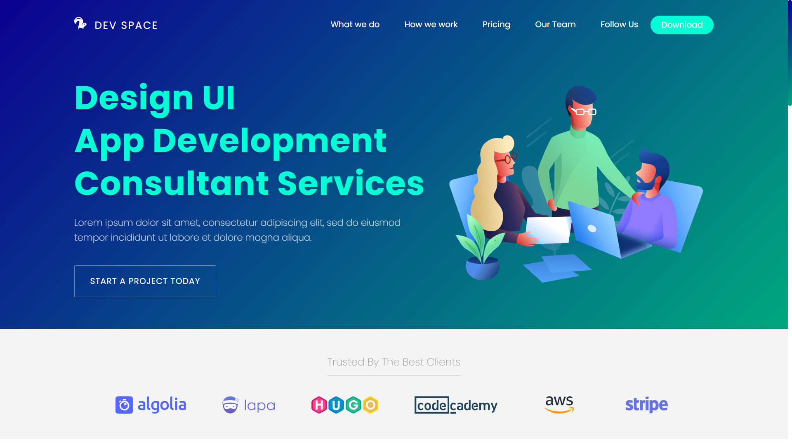

# Project Description: Dev Space Website

This project is a static website for Dev Space, a company offering course development services. The website provides information about the company's services, team, clients, and ways to connect. It is built using HTML and CSS.

## Table of Contents

1. [Introduction](#introduction)
2. [Features](#features)
3. [Screenshots](#screenshots)
4. [Installation](#installation)
5. [Demo](#demo)
6. [Contributing](#contributing)

## Introduction

This repository contains the code for the Dev Space website. The website showcases the company's services, including interface design, web application development, and software development. It also highlights the team members, clients, and open-source contributions.

## Features

-   Responsive design to ensure optimal viewing experience across various devices.
-   Navigation menu for easy access to different sections of the website.
-   Slider component displaying key services provided by the company.
-   Section dedicated to showcasing clients who trust the company's services.
-   Detailed sections explaining what the company does and how they work.
-   Information about the team members, their roles, and links to their profiles.
-   Promotion of open-source contributions with a call-to-action to follow the company on GitHub.
-   Footer containing links to various services, clients, and contact information.

## Screenshots

## Installation

To run this website locally, follow these steps:

1. Clone this repository: `git clone https://github.com/DungDevIT/course-developer.git`
2. Navigate to the project directory: `cd course-developer`
3. Open `index.html` in your web browser.

## Demo

1. Link: `https://github`
2. Video: []

## Contributing

Contributions are welcome! If you find any issues or have suggestions for improvement, please open an issue or submit a pull request.
